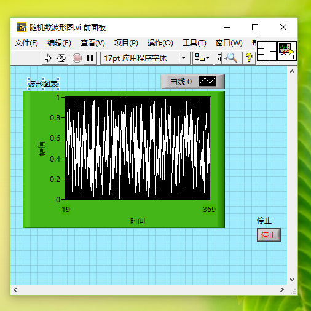
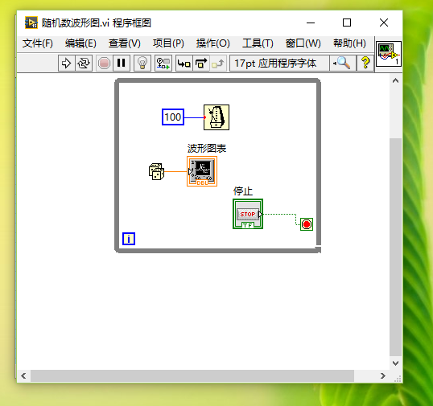

# 学习labview，从零开始。
##1我的labview
        其实，我本来并不知道labview这个软件，是上学期选的一门叫做电子测量技术的课，苏大的老师来给我们上过2次课，后来因为老师让我们在github网站上注册，让我们自学电子测量技术，只扔给我们2个软件和许多电子课程，说是让我们自学，我们班的学生就不干了，本来也是，这么多年都是跟在老师后面瞎忙活，现在老师突然让我们自己学习，感觉天都塌下来了。于是，在老师的严格要求下，我们班的小朋友们纷纷退课，到最后老师的课都不开了。我真不知道是该难受呢？还是该高兴？
        好吧，那么我自己来吧！我不知道我会坚持到多久，自学，好多东西都是依葫芦画瓢，不懂得我该怎么解决。
        为什么labview直接就是通过框框图图来表示实际电路中的电流流向以及产生的许多现象，我可以跟着教程上的框图去一步步做下去，可是我有好多的地方都不明白。

###就像下图

](捕获2.PNG)
我的小框图虽然也能跑，可是我并不知道这其中的数值是怎样流动，又是怎样的运算的，我情愿它给我一行行的c代码，让我慢慢揣摩，搞明白它的意思。